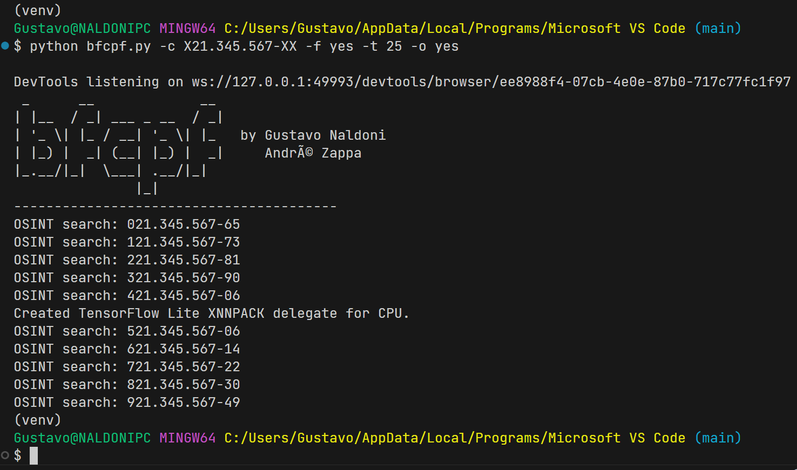

# bfcpf

bfcpf stands for "Brute Force CPF" and it is a CLI tool that breaks a partial CPF, finding all valid ones within the pattern given by the user.

For those who does not know, CPF is the Personal Identity Code in Brazil.

## Instalation

After installing [Git](https://git-scm.com/downloads) and [Python](https://www.python.org/downloads/), open a terminal and type the following:

    $ git clone https://github.com/gustavonaldoni/bfcpf.git
    $ cd bfcpf
    $ python -m venv venv
    $ source ./venv/Scripts/activate
    $ pip install -r requirements.txt

The first two commands, respectively, downloads the source code of the tool and opens that folder on terminal. After that we create a Python virtual environment (venv), activate it on this terminal and install all required dependencies.

Now you must be ready to go!

## Screenshots

The example above produced a file named `X21.345.567-XX.txt`, shown below:

    Valid CPFs found:

    021.345.567-65
    121.345.567-73
    221.345.567-81
    321.345.567-90
    421.345.567-06
    521.345.567-06
    621.345.567-14
    721.345.567-22
    821.345.567-30
    921.345.567-49

    --------------------

    OSINT info about the CPFs:

    121.345.567-73: ('gov_transparency_portal', 'Thiago Silva Muniz') 

## Usage

    $ python bfcpf.py -c 1XX.X3X.568-XX
    $ python bfcpf.py -c XXX.345.567-XX -f yes
    $ python bfcpf.py -c XXX.345.567-XX -f yes -t 25

The meaning of each flag is described below:

    -c or --cpf: the partial cpf with ponctuation to break (*)
    -f or --file: output as a file (yes/no - default=no)
    -t or --threads: number of threads to use while breaking the CPF (default=10)
    -o or --osint: use OSINT (yes/no - default=yes)

Note that the flags marked with (*) are REQUIRED by the program to execute!

## IMPORTANT!

There are several things to note about this script:

- Because of *combinatorics* the number of possibilities of every `X` on the CPF increases by a factor of 10. Thus, for `n` entries `X`, there are `10^n` possible CPF's. This is important because you can easily empty your RAM with `n > 5`.
- The OSINT information gathered by this program is completely FREE and uses only public data, available to anyone with Internet access.